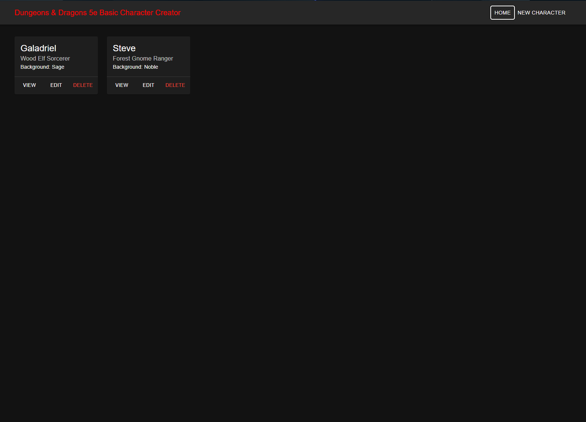
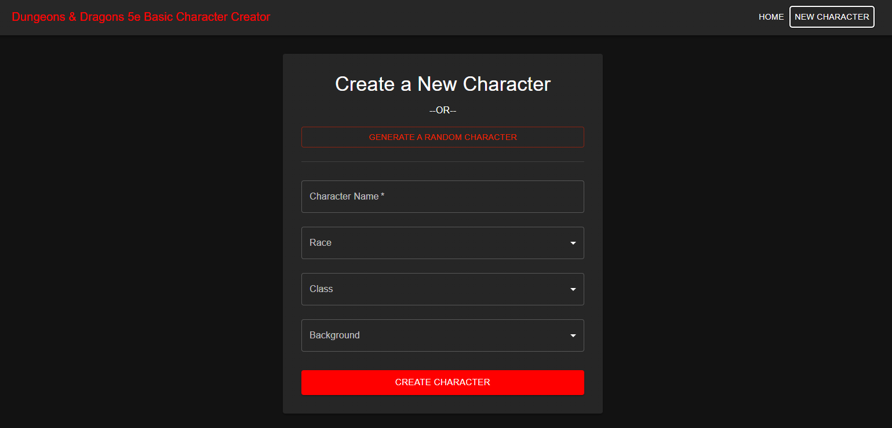
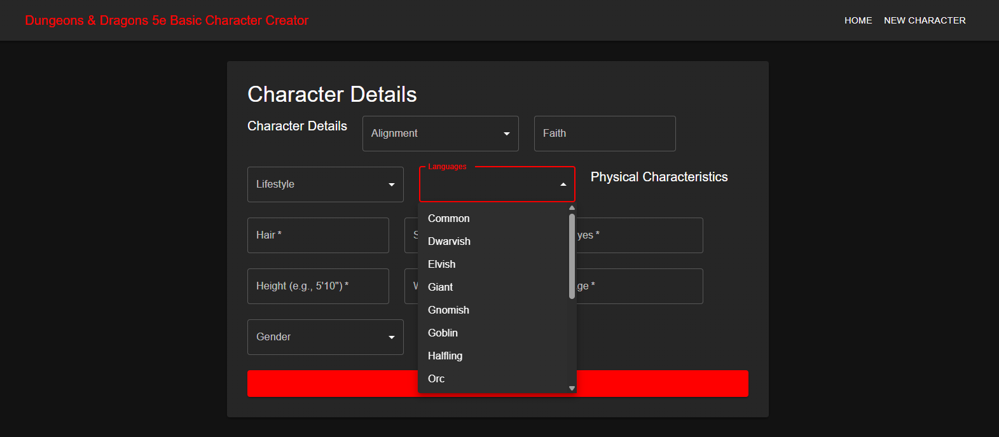
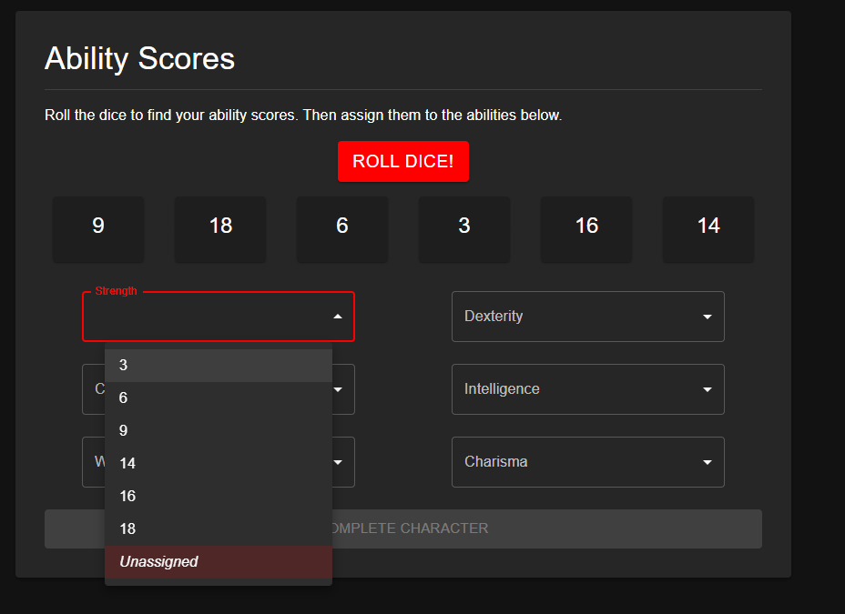
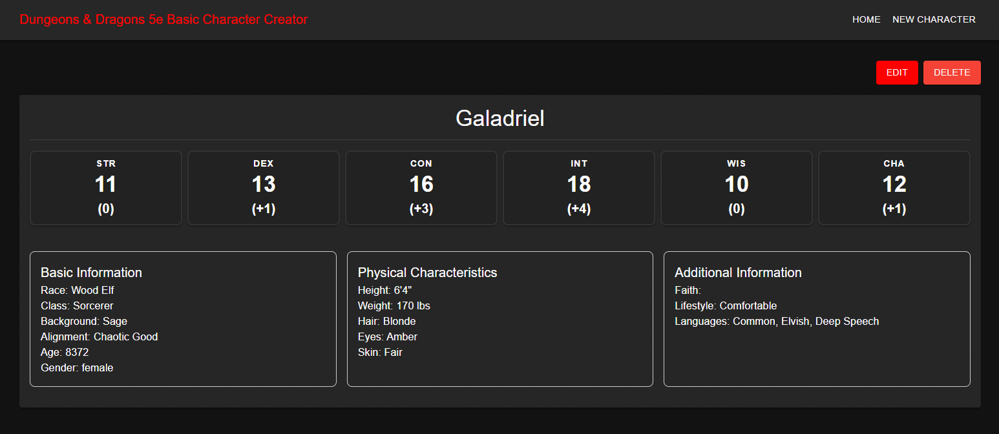

# 🐉 Dungeons & Dragons 5e Character Creator  
_A full-stack MERN application for generating, customizing, and saving D&D 5e characters._

## 🎯 Overview
This project is a basic character-creation tool built for **Dungeons & Dragons 5th Edition**.  
It allows users to **generate characters**, **customize every detail**, and **store them in MongoDB** for later editing or deletion.

The app provides a clean, modern UI inspired by gaming dashboards and walks the user through creating a character step-by-step:

1. **Create or Randomize a character**
2. **Enter role-play & demographic details**
3. **Roll and assign ability scores**
4. **View, edit, or delete saved characters**

This project was built as part of my final full-stack development assessment and demonstrates React UI design, backend engineering, database design, and CRUD operations.

---

# 🚀 Live Demo
**Live App:** _Coming soon_

---

# 🛠 Tech Stack

### Frontend
- React  
- React Router  
- Context API (state management)  
- Custom form components  
- Responsive CSS / dark UI theme  
- Dice-rolling and validation logic

### Backend
- Node.js  
- Express  
- REST API (characters CRUD)  
- MongoDB + Mongoose schema design  
- Input validation and sanitization  

### Database
- MongoDB (Atlas or local)  
- Characters stored with full structured metadata:
  - Name, age, gender  
  - Race, class, background  
  - Languages  
  - Physical characteristics  
  - Ability scores and modifiers  
  - Lifestyle, faith, alignment  

---

# ✨ Features

### 🧙‍♂️ Character Creation  
- Fully guided character creation workflow  
- Optional **random character generator**  
- Custom dropdowns for:
  - Race  
  - Class  
  - Background  
  - Lifestyle  
  - Faith  
  - Alignment  
  - Gender  
  - Languages (multi-select)  

---

### 🎲 Ability Score Generation  
- “Roll Dice” button that generates six values  
- Assign rolled values to abilities  
- Validation prevents reuse of the same value  

---

### 📝 Character Profile  
Once completed, characters display as a full profile card including:

- Ability scores and modifiers  
- Basic Information  
- Physical Characteristics  
- Additional Information  

Users can:

- View  
- Edit  
- Delete  

characters directly from the dashboard.

---

# 🔧 Installation & Setup

### 1. Clone the repository
    git clone https://github.com/ArgonautCaptain/dnd-character-generator
    cd dnd-character-generator

### 2. Install dependencies

Backend:
    
    cd backend
    npm install

Frontend:
    
    cd ../frontend
    npm install

### 3. Create a `.env` for the backend

    MONGO_URI=<your-mongodb-connection-string>
    PORT=5000

### 4. Start the backend

    cd backend
    node index.js

### 5. Start the frontend

    cd frontend
    npm run dev

---

# 🧪 API Endpoints

| Method | Endpoint                  | Description           |
|--------|---------------------------|-----------------------|
| GET    | /api/characters           | Get all characters    |
| POST   | /api/characters           | Create new character  |
| GET    | /api/characters/:id       | Get single character  |
| PUT    | /api/characters/:id       | Update character      |
| DELETE | /api/characters/:id       | Delete character      |

---

# 📜 License
MIT License

---

# 🙌 Acknowledgements
Inspired by **Dungeons & Dragons 5th Edition** character creation rules.  
All D&D terminology is © Wizards of the Coast.
